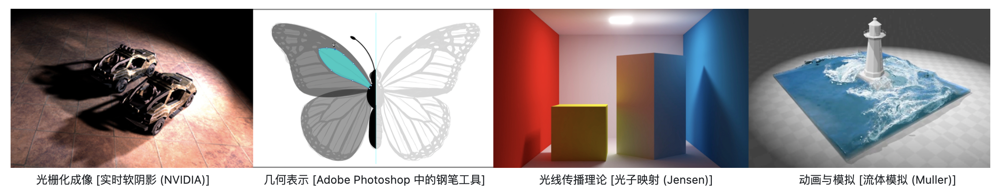

# GAMES101: 现代计算机图形学入门

本课程将全面而系统地介绍现代计算机图形学的四大组成部分：（1）光栅化成像，（2）几何表示，（3）光的传播理论，以及（4）动画与模拟。每个方面都会从基础原理出发讲解到实际应用，并介绍前沿的理论研究。通过本课程，你可以学习到计算机图形学背后的数学和物理知识，并锻炼实际的编程能力。

顾名思义，作为入门，本课程会尽可能的覆盖图形学的方方面面，把每一部分的基本概念都尽可能说清楚，让大家对计算机图形学有一个完整的、自上而下的全局把握。全局的理解很重要，学完本课程后，你会了解到图形学不等于 OpenGL，不等于光线追踪，而是一套生成整个虚拟世界的方法。从本课程的标题，大家还可以看到“现代”二字，也就是说，这门课所要给大家介绍的都是现代化的知识，也都是现代图形学工业界需要的图形学基础。

本课程与其它图形学教程还有一个重要的区别，那就是本课程不会讲授 OpenGL，甚至不会提及这个概念。本课程所讲授的内容是图形学背后的原理，而不是如何使用一个特定的图形学 API。在学习完这门课的时候，你一定有能力自己使用 OpenGL 写实时渲染的程序。另外，本课程并不涉及计算机视觉、图像视频处理、深度学习，也不会介绍游戏引擎与三维建模软件的使用。

具体课程内容请参见[课程大纲](https://sites.cs.ucsb.edu/~lingqi/teaching/games101.html)。